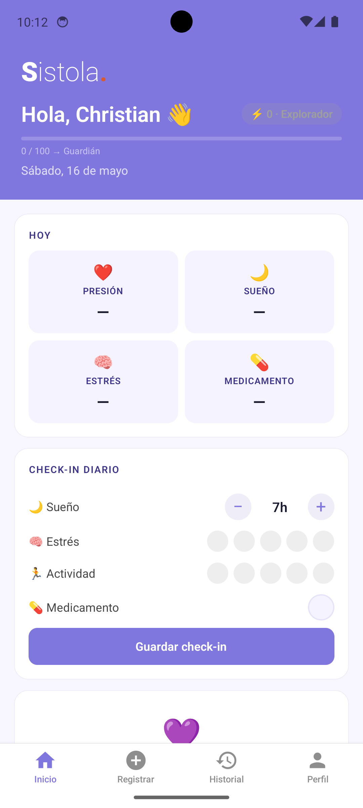
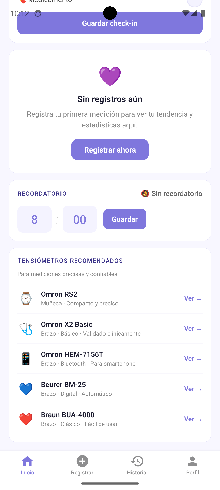
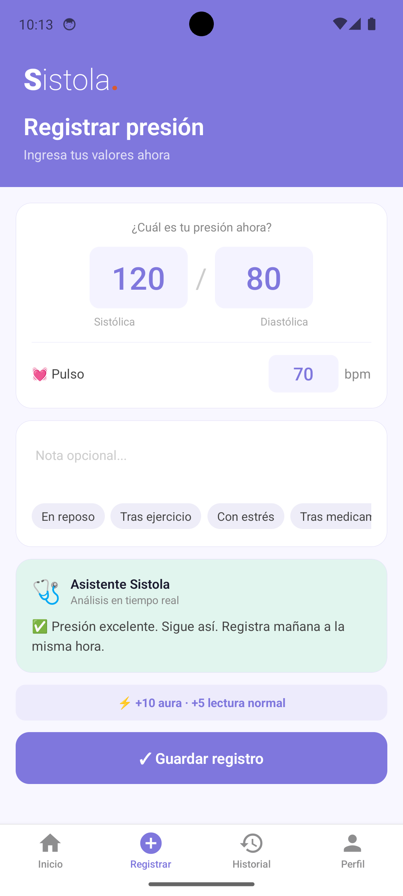
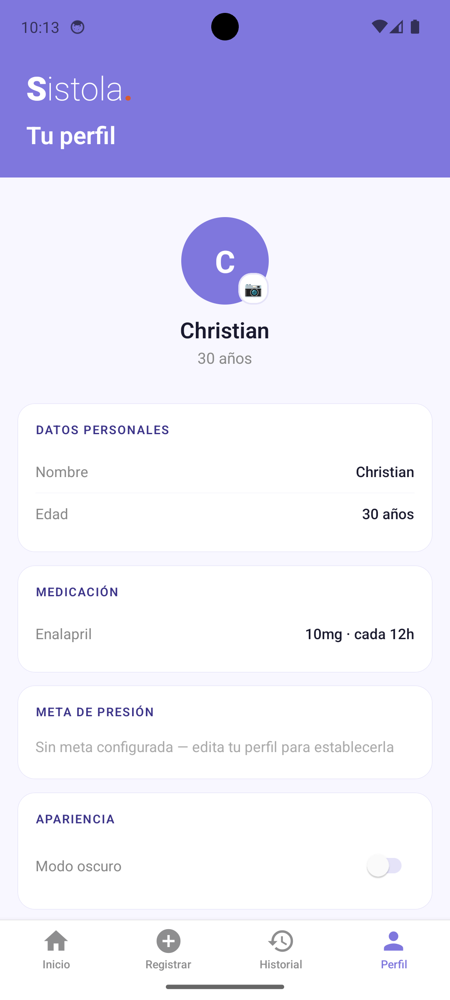
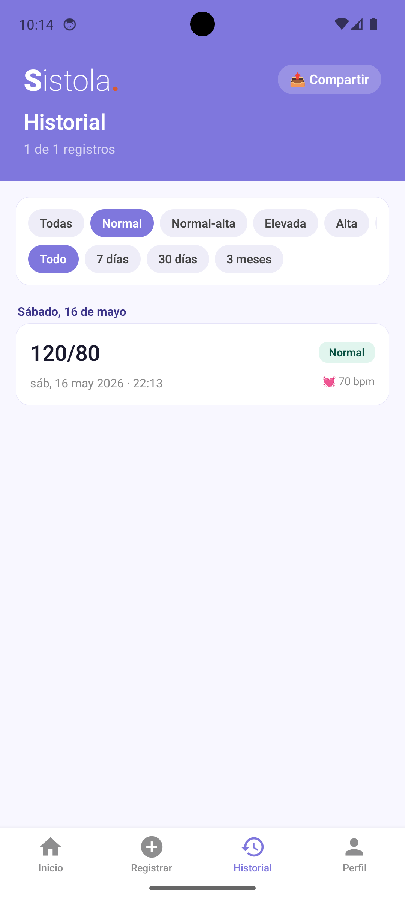

# Sistola — Blood Pressure Monitor

> Mobile app for tracking blood pressure, daily wellness habits, and medication adherence. Built with React Native + Expo. Available on Android.

[🇪🇸 Español](#sistola--monitor-de-presión-arterial) · [📲 Download APK](#download)

---

## Screenshots

<p align="center">
  
  
  
  
  
</p>

## Features

- **Blood pressure logging** — clinical validation (ESC/ESH 2018 guidelines), critical BP alert with emergency call button
- **Smart dashboard** — trend insight, weekly streak, week-over-week comparison
- **Trend chart** — systolic, diastolic and pulse over the last 14 days with custom goal line
- **Daily check-in** — sleep, stress and activity tracking with contextual wellness feedback
- **Full history** — filters by classification and period, swipe-to-delete, export to text / CSV / PDF
- **Gamification** — aura points system, progressive levels and 8 unlockable achievements
- **Push reminders** — daily notification with configurable time
- **Dark mode** — manual toggle, fully theme-aware across all components
- **Backup & restore** — export/import JSON with validation
- **Customizable profile** — photo or emoji avatar, medication adherence tracking

## Tech Stack

| Technology | Role |
|---|---|
| React Native 0.81 + Expo SDK 54 | Core framework |
| Expo Router 6 | File-based navigation |
| TypeScript (strict) | Full type coverage |
| AsyncStorage | Local persistence (no backend) |
| react-native-svg | Line charts |
| expo-notifications | Push reminders |
| expo-print + expo-sharing | PDF/CSV export |
| expo-image-picker | Profile avatar |
| react-native-gesture-handler | Swipe-to-delete |
| react-native-view-shot | Chart capture as image |

## Architecture

```
app/
  _layout.tsx          # Root layout with ThemeSchemeProvider
  onboarding.tsx       # 3-step wizard with WHO/ESC 2018 medication picker
  (tabs)/
    index.tsx          # Main dashboard
    explore.tsx        # Blood pressure registration
    historial.tsx      # History with stats and export
    perfil.tsx         # Profile and settings
components/
  bp-chart.tsx         # Theme-aware BP line chart
  checkin-chart.tsx    # Sleep/stress chart
  medicamento-picker.tsx
contexts/
  theme.tsx            # ThemeSchemeProvider + useAppScheme()
utils/
  notifications.ts
  insights.ts          # Trend analysis, sleep correlation, streak
  gamificacion.ts      # Aura calculation, levels, achievements
  medicamentos.ts      # WHO/ESC 2018 medication list
constants/
  theme.ts             # Light and dark color tokens
hooks/
  use-theme-color.ts   # useColors() — returns active theme
```

## BP Classification (ESC/ESH 2018)

```
SYS ≥ 180 | DIA ≥ 110  →  Crisis        (Grade 3 Hypertension)
SYS ≥ 160 | DIA ≥ 100  →  High          (Grade 2 Hypertension)
SYS ≥ 140 | DIA ≥  90  →  Elevated      (Grade 1 Hypertension)
SYS ≥ 130 | DIA ≥  85  →  Normal-high
otherwise               →  Normal
```

## Run Locally

```bash
npm install
npx expo start
```

For a physical device build (requires EAS CLI):

```bash
eas build --profile preview --platform android
```

## Download

> APK available in [Releases](../../releases)

## Design

- Primary color: `#7F77DD` (purple)
- Full light and dark mode
- No external UI libraries — custom StyleSheet with theme tokens

---

---

# Sistola — Monitor de Presión Arterial

> App móvil para monitorear la presión arterial, registrar hábitos de bienestar y mantener la adherencia a medicamentos. Disponible en Android.

## Funcionalidades

- **Registro de presión arterial** — validación clínica (ESC/ESH 2018), alerta de presión crítica con llamada de emergencias
- **Dashboard inteligente** — insight de tendencia, racha semanal, comparativa con semana anterior
- **Gráfico de tendencia** — sistólica, diastólica y pulso en los últimos 14 días con línea de meta
- **Check-in diario** — sueño, estrés y actividad con feedback contextual de bienestar
- **Historial completo** — filtros por clasificación y período, swipe-to-delete, export a texto/CSV/PDF
- **Gamificación** — sistema de aura, niveles progresivos y 8 logros desbloqueables
- **Recordatorios push** — notificación diaria con hora configurable
- **Modo oscuro** — toggle manual, tema-aware en todos los componentes
- **Copia de seguridad** — export/import JSON con validación
- **Perfil personalizable** — foto o emoji de avatar, adherencia a medicamentos

## Correr localmente

```bash
npm install
npx expo start
```

## Licencia

MIT
